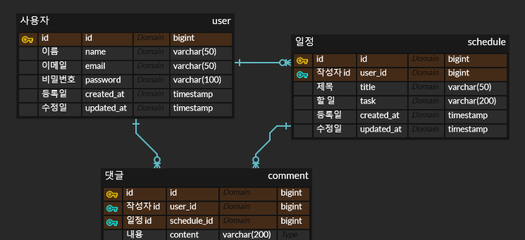

# 일정 관리 앱

일정을 관리할 수 있는 앱의 API 서버 개발

사용자 CRUD, 일정 CRUD, 댓글 CRUD 기능이 있다.

## 개발 환경
-  
-  
-  
- 

## 프로젝트 구조
```
📂 nbc
└── 📂 sma
    ├── 📂 controller                
    │   ├── 📄 AuthController    
    │   ├── 📄 CommentController    
    │   ├── 📄 ScheduleController    
    │   └── 📄 UserController  
    │     
    ├── 📂 dto    
    │   ├── 📂 request        
    │   │   ├── 📄 CreateCommentRequest
    │   │   ├── 📄 CreateScheduleRequest
    │   │   ├── 📄 LoginRequest
    │   │   ├── 📄 RegisterRequest
    │   │   ├── 📄 UpdateCommentRequest
    │   │   │── 📄 UpdateScheduleRequest
    │   │   └── 📄 UpdateUserRequest
    │   │── 📂 response              
    │   │   ├── 📄 CommentResponse
    │   │   ├── 📄 ScheduleResponse
    │   │   └── 📄 UserResponse
    │   │   └── 📄 UsersResponse
    │   └── 📂 mapper                    
    │        ├── 📄 CommentController
    │        ├── 📄 ScheduleMapper
    │        └── 📄 UserMapper
    │
    ├── 📂 entity                    
    │   ├── 📄 BaseEntity
    │   ├── 📄 Comment
    │   ├── 📄 Schedule
    │   └── 📄 User
    │
    ├── 📂 exception                              
    │   ├── 📄 BizException
    │   ├── 📄 ErrorResponse
    │   ├── 📄 ForbiddenException
    │   ├── 📄 GlobalControllerAdvice
    │   ├── 📄 InvalidPasswordException         
    │   └── 📄 NotFoundException
    │
    ├── 📂 repository   
    │   ├── 📄 CommentRepository
    │   ├── 📄 ScheduleRepository
    │   └── 📄 UserRepository
    │
    ├── 📂 security                    
    │   ├── 📄 LoginFilter
    │   ├── 📄 PasswordEncoder
    │   ├── 📄 SecurityConfig
    │   └── 📄 SessionConst   
    │
    ├── 📂 service                    
    │   ├── 📄 CommentService
    │   ├── 📄 ScheduleService
    │   ├── 📄 UserService
    │  
    ├──📄 ScheduleManagementApplication
    │
    └── 📂 resources                            
        └── 📄 application.yml    
```

## 실행 방법
1. resources/application.yml 에서 데이터베이스 연결 정보를 수정
2. ./gradlew bootJar (Linux, Mac) or ./gradlew.bat bootJar (Windows)
3. http://localhost:8080/* (API 주소)

## 설계

### ERD


### API 명세서

#### Users

<div style="overflow-x: auto;">

| **Method** | **Endpoint** | **Description** | **Parameters**                                              | **Request Body**                                               | **Response**                                                                                                                             | **Status Code** |
|------------|-------------|-----------------|-------------------------------------------------------------|----------------------------------------------------------------|------------------------------------------------------------------------------------------------------------------------------------------|-----------------|
| `POST`     | `/users` | 회원 가입           | 없음                                                          | `{ "name": string, "email": string, "password": string }` | `{ "id": long, "name": string, "email": string }`                                                                                        | `200 OK`        |
| `GET`      | `/users`    | 회원 목록 조회        | 없음                                           | 없음                                                             | `{ "results" : [ { "id": long, "name": string, "email": string, "password": string, "createdAt": string, "updatedAt": string }, ... ] }` | `200 OK`        |
| `GET`      | `/users/{id}` | 회원 단건 조회        | Path: <br> - `id`                                           | 없음                                                             | `{ "id": long, "name": string, "email": string }`                          | `200 OK`        |
| `PUT`      | `/users` | 회원 수정           | 없음                                 | `{ "name": string, "email": string }`                          | 없음                           | `200 OK`        |
| `DELETE`   | `/users`    | 회원 삭제           | 없음 | 없음                                                             | 없음                                                                                                                                       | `200 OK`        |

</div>

#### Auth

<div style="overflow-x: auto;">

| **Method** | **Endpoint**  | **Description** | **Parameters**                                              | **Request Body**                                               | **Response**                                                                                                                             | **Status Code** |
|------------|---------------|-----------------|-------------------------------------------------------------|----------------------------------------------------------------|------------------------------------------------------------------------------------------------------------------------------------------|-----------------|
| `POST`     | `/auth/login` | 로그인             | 없음                                                          | `{ "email": string, "password": string }`                      | `{ "id": long, "name": string, "email": string }`                                                                                        | `200 OK`        |

</div>

#### Schedules

<div style="overflow-x: auto;">

| **Method** | **Endpoint**              | **Description**                 | **Parameters**                                                | **Request Body**                      | **Response**                                                                                                                                                                                         | **Status Code** |
|------------|---------------------------|---------------------------------|---------------------------------------------------------------|---------------------------------------|------------------------------------------------------------------------------------------------------------------------------------------------------------------------------------------------------|-----------------|
| `POST`     | `/schedules`              | 일정 생성                       | 없음                                                            | `{ "title": string, "task": string }` | `{ "id": long, "user": { "id": long, "name": string, "email": string }, "title": string, "task": string, "createdAt": string, "updatedAt": string }`                                                 | `200 OK`        |
| `GET`      | `/schedules`              | 일정 목록 조회                | Query: <br> - `page` (default: 0) <br> - `size` (default: 10) | 없음                                    | `{ "content": [ { "id": long, "user": { "id": long, "name": string, "email": string }, "title": string, "task": string, "createdAt": string, "updatedAt": string }, ... ], "pageable": {...}, ... }` | `200 OK`        |
| `GET`      | `/schedules/{id}`         | 일정 단건 조회                | Path: <br> - `id`                                             | 없음                                    | `{ "id": long, "user": { "id": long, "name": string, "email": string }, "title": string, "task": string, "createdAt": string, "updatedAt": string }`                                                 | `200 OK`        |
| `PUT`      | `/schedules/{id}`         | 일정 수정                     | Path: <br> - `id`                                             | `{ "title": string, "task": string }` | 없음                                                                                                                                                                                                   | `200 OK`        |
| `DELETE`   | `/schedules/{id}`         | 일정 삭제                     | Path: <br> - `id`                                             | 없음                                    | 없음                                                                                                                                                                                                   | `200 OK`        |

</div>

#### Comments

<div style="overflow-x: auto;">

| **Method** | **Endpoint**                                   | **Description** | **Parameters**                                                                          | **Request Body**                                                   | **Response**                                                                                                                                                                      | **Status Code** |
|------------|------------------------------------------------|-----------------|-----------------------------------------------------------------------------------------|--------------------------------------------------------------------|-----------------------------------------------------------------------------------------------------------------------------------------------------------------------------------|-----------------|
| `POST`     | `/schedules/{scheduleId}/comments`             | 댓글 생성           | Path: <br> - `scheduleId`                                                               | `{ "content": string }` | `{ "id": long, "user": { "id": long, "name": string, "email": string }, "content": string, "createdAt": string, "updatedAt": string }` | `200 OK`        |
| `GET`      | `/schedules/{scheduleId}/comments`             | 댓글 목록 조회        | Path: <br> - `scheduleId` Query: <br> - `page` (default: 0) <br> - `size` (default: 10) | 없음                                                                 | `{ "content": [ { "id": long, "user": { "id": long, "name": string, "email": string }, "content": string, "createdAt": string, "updatedAt": string }, ... ], "pageable": {...}, ... }`     | `200 OK`        |
| `PATCH`    | `/schedules/{scheduleId}/comments/{commentId}` | 댓글 수정           | Path: <br> - `scheduleId` <br> - `commentId`                                            | `{ "content": string }`    | 없음                                                           | `200 OK`        |
| `DELETE`   | `/schedules/{scheduleId}/schedules/{commentId}`       | 댓글 삭제           | Path: <br> - `scheduleId` <br> - `commentId`                                            | 없음                                                                 | 없음                                                                                                                                                                                | `200 OK`        |

</div>

<br>

## 트러블 슈팅
[Link](https://dungbik.github.io/p/til-3/)